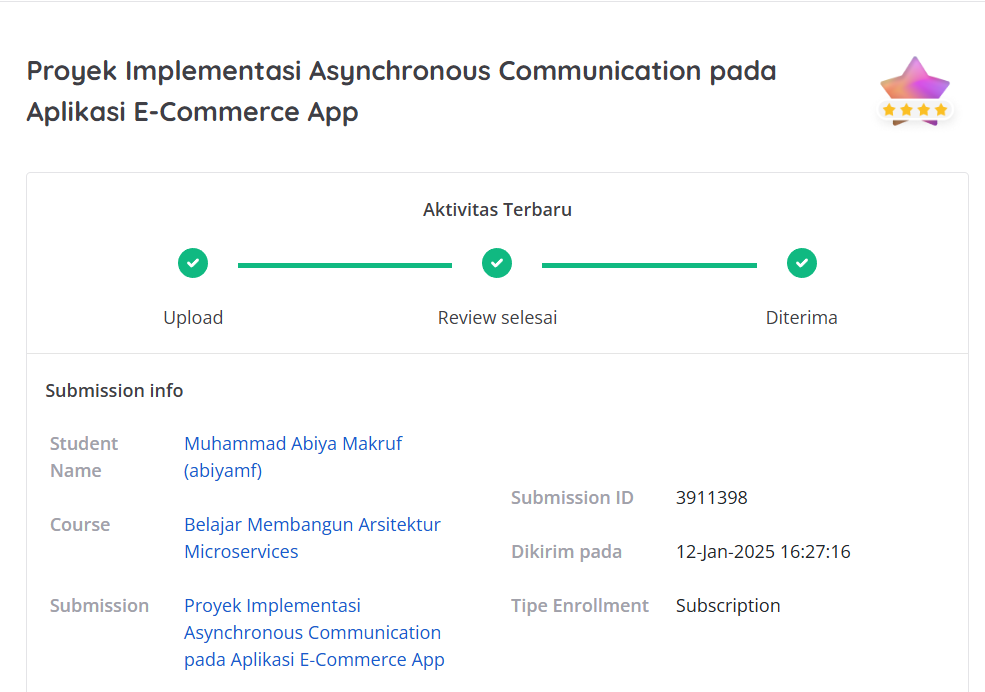

# Proyek Kedua: Dicoding-DeployAplikasiKarsaJobsdenganKubernetes
## Penilaian Proyek
Proyek ini berhasil mendapatkan bintang 4/5 pada submission dicoding course Belajar Membangun Arsitektur Microservices.



Kriteria tambahan yang saya kerjakan sehingga mendapatkan nilai terbaik:
1. Memberikan penjelasan dalam bentuk komentar untuk setiap baris kode pada semua berkas yang ada.
2. Alih-alih Docker Hub, Anda menggunakan GitHub Packages untuk penyimpanan image.
3. Alih-alih Docker Compose, Anda men-deploy aplikasi E-Commerce App menggunakan Kubernetes.

Kriteria tambahan yang tidak saya kerjakan:
1. Mengimplementasikan service mesh dengan Istio (service mesh) pada aplikasi E-Commerce App di Kubernetes.

# 🚳 E-Commerce App with Asynchronous Communication 🚀

### **Implementasi Microservices dengan RabbitMQ, Kubernetes, dan GitHub Packages**

## 📌 **Deskripsi Proyek**
E-Commerce App adalah proyek implementasi **asynchronous communication** dengan **RabbitMQ** pada arsitektur **microservices**. Aplikasi ini terdiri dari:
- 🍽️ **Order Service**: Menerima pesanan dan mengirimkannya ke RabbitMQ.
- 📦 **Shipping Service**: Mengambil data pesanan dari RabbitMQ dan memproses pengiriman.
- 🐇 **RabbitMQ**: Bertindak sebagai message broker untuk komunikasi antar layanan.

Proyek ini menggunakan **Docker, Kubernetes, dan GitHub Packages** untuk containerization dan deployment. 🎯

---

## 🏐 **Teknologi yang Digunakan**
- 🟢 **Node.js** (Backend API)
- 💪 **Docker** (Containerization)
- ♸️ **Kubernetes** (Deployment & Orchestration)
- 🐇 **RabbitMQ** (Message Broker)
- 🛠️ **GitHub Packages** (Container Registry)
- 📡 **Postman/cURL** (API Testing)

---

## 📂 **Struktur Proyek**
```
├── orderservice/           # Order Service
│   ├── index.js            # Entry point
│   ├── package.json        # Dependencies
│   ├── Dockerfile          # Docker configuration
│   ├── build_and_push.sh   # Script to push image to GitHub Packages
├── shippingservice/        # Shipping Service
│   ├── index.js
│   ├── package.json
│   ├── Dockerfile
│   ├── build_and_push.sh
├── kubernetes/             # Kubernetes deployment manifests
│   ├── rabbitmq-statefulset.yaml
│   ├── order-service-deployment.yaml
│   ├── shipping-service-deployment.yaml
├── README.md               # Documentation
```

---

## 🚀 **Cara Menjalankan Proyek**

### **1️⃣ Clone Repository**
```sh
git clone https://github.com/AbiyaMakruf/Dicoding-ImplementasiAsynchronousCommunicationpadaAplikasiE-CommerceApp.git
cd Dicoding-ImplementasiAsynchronousCommunicationpadaAplikasiE-CommerceApp
```

### **2️⃣ Setup RabbitMQ (Opsional untuk Lokal)**
Jika ingin menjalankan RabbitMQ di lokal tanpa Kubernetes:
```sh
docker run -d --name rabbitmq -p 5672:5672 -p 15672:15672 rabbitmq:3.11-management
```
🛠️ **Akses RabbitMQ UI** di 👉 [http://localhost:15672](http://localhost:15672) (user: `guest`, pass: `guest`)

---

## 🐛 **Containerization & Push ke GitHub Packages**
### **3️⃣ Build & Push Docker Image**
Pastikan sudah login ke GitHub Packages sebelum menjalankan script:
```sh
export PAT="your-github-token"
```

**📚 Build & Push Order Service**
```sh
cd order-service
chmod +x build_and_push.sh
./build_and_push.sh
```

**📚 Build & Push Shipping Service**
```sh
cd ../shipping-service
chmod +x build_and_push.sh
./build_and_push.sh
```

---

## ♸️ **Deployment ke Kubernetes**
### **4️⃣ Deploy ke Kubernetes**
Pastikan **kubectl** sudah terhubung ke cluster sebelum menjalankan perintah berikut:
```sh
kubectl apply -f kubernetes/rabbitmq-statefulset.yaml
kubectl apply -f kubernetes/order-service-deployment.yaml
kubectl apply -f kubernetes/shipping-service-deployment.yaml
```

Cek apakah semua pod sudah berjalan:
```sh
kubectl get pods
```

---

## 🔥 **Testing API**
### **5️⃣ Port Forwarding untuk Testing**
Gunakan **Postman** atau **cURL** untuk mengirim pesanan setelah port-forwarding:

```sh
kubectl port-forward service/order-service 3000:3000
```

#### **📝 Kirim Order (POST Request) menggunakan postman**
```json
{
    "order": {
        "book_name": "Harry Potter",
        "author": "J.K Rowling",
        "buyer": "Fikri Helmi Setiawan",
        "shipping_address": "Jl. Batik Kumeli no 50 Bandung"
    }
}
```

Cek apakah **Shipping Service menerima pesanan** dengan:
```sh
kubectl logs -f deployment/shipping-service
```

---

## 🎉 **Terima Kasih!**

